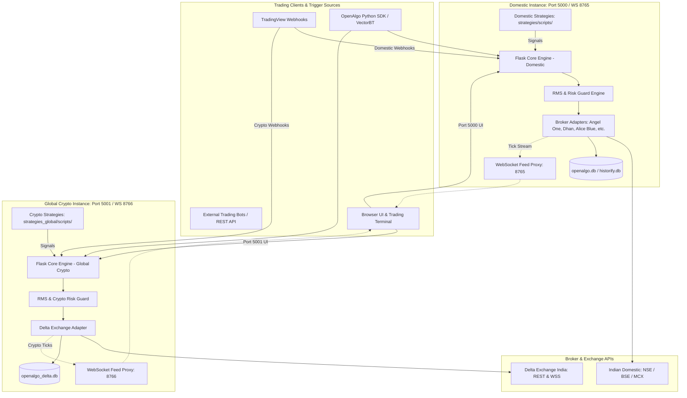

# OpenAlgo Architecture Reference

## System Architecture Diagram



---

## 1. Dual-Instance Isolation Invariant

| Attribute | Domestic Instance (`openalgo-angel`) | Global Crypto Instance (`openalgo-global`) |
|---|---|---|
| **HTTP Port** | `5000` | `5001` |
| **WebSocket Port** | `8765` | `8766` |
| **Supported Markets** | NSE, BSE, MCX (Equity, Futures, Options) | Delta Exchange (BTC, ETH perpetuals & options) |
| **Strategy Directory** | `strategies/scripts/` | `strategies_global/scripts/` |
| **Strategy Config** | `strategies/strategy_configs.json` | `strategies_global/strategy_configs.json` |
| **State Storage** | `data/` | `strategies_global/data/` |
| **Database File** | `openalgo.db`, `historify.db` | `openalgo_delta.db`, `sandbox_delta.db` |
| **Broker Client** | Angel One, Dhan, Fyers, Alice Blue, etc. | Delta Exchange India API (`api.india.delta.exchange`) |
| **Cross-Pollution Rule** | **STRICT ZERO TOLERANCE**: Never route crypto orders to 5000, and never place NSE/BSE orders to 5001. |

---

## 2. Directory Structure & Module Responsibilities

```
openalgo/
├── app.py                     # Primary Flask entry point & blueprint registration
├── blueprints/                # Modular REST route handlers
│   ├── auth.py                # Login, session tokens, TOTP verification
│   ├── order.py               # Order placement, modification, cancellation
│   ├── options.py             # Multi-leg option order execution (straddles, condors)
│   ├── python_strategy.py     # Strategy lifecycle management (start, stop, status)
│   ├── market_data.py         # Quotes, depth, historical candles
│   └── flow.py                # No-code node-graph workflow engine
├── broker/                    # Pluggable broker adapters (36+ supported brokers)
│   ├── angelone/              # Angel One SmartAPI client implementation
│   ├── delta/                 # Delta Exchange REST/WebSocket client
│   └── base.py                # Abstract Base Broker interface
├── database/                  # SQLite connection pooling & migration scripts
├── execution_engine/          # Safe order execution, position tracking, fills
├── strategies/                # Indian domestic strategies (Port 5000)
│   ├── scripts/               # Strategy python executables
│   └── strategy_configs.json  # Strategy registration and schedules
├── strategies_global/         # Delta Exchange crypto strategies (Port 5001)
│   ├── scripts/               # BTC & ETH perpetual & options scripts
│   ├── data/                  # Persistent JSON state journals & run locks
│   └── strategy_configs.json  # Global strategy registration
├── services/                  # Business logic (order validation, RMS, alerts)
├── websocket_proxy/           # High-throughput tick distribution server
├── frontend/                  # UI assets, dashboard templates, and charts
├── docs/                      # Central persistent project knowledge base
└── .agents/                   # AI agent rules, memory, and specialized skills
```

---

## 3. End-to-End Data Flow

1. **Signal Generation**:
   - In-process or external strategy (`strategies_global/scripts/BTC_Liquidity_Sweep_Perp.py`) evaluates 1H candle closes against 4H macro trend.
   - Strategy formats an execution payload: symbol, exchange, product, action, quantity, price_type, stop_loss, take_profit.
2. **Gateway Ingestion**:
   - Payload hits `/api/v1/placeorder` with `X-API-Key` authentication.
   - Blueprint routes request to `services/order_service.py`.
3. **Risk Management System (RMS) Audit**:
   - Pre-trade validation verifies max order value, available margin, price bounds, circuit limits, and duplicate order signatures.
4. **Broker Adapter Translation**:
   - Broker adapter (`broker/delta/`) maps unified OpenAlgo parameters into native exchange payload.
   - Dispatches HTTPS request to broker gateway.
5. **Fill Journaling & State Management**:
   - Order ID and status recorded in SQLite database.
   - Multi-leg strategies journal fill transitions to avoid orphaned positions.
6. **Real-Time Notification & WebSocket Broadcast**:
   - Execution events pushed to internal event bus.
   - WebSocket proxy streams trade status and updated PnL to UI dashboard.

---

## 4. Architectural Decision Log

| Decision | Alternative Considered | Rationale |
|---|---|---|
| **Dual Flask Instances (5000 vs 5001)** | Single unified monolith | Prevents latency cross-talk and thread contention between high-frequency 24/7 crypto and Indian market trading hours. Total isolation prevents accidental market pollution. |
| **SQLite + WAL Mode** | PostgreSQL / Redis | Zero-dependency self-hosting for retail algorithmic traders. WAL (Write-Ahead Logging) supports high-concurrency read operations during live market streaming. |
| **VectorBT Backtesting Engine** | Backtrader / Custom Loop | VectorBT provides 100x speedup via NumPy vectorization, enabling parameter sweeps over hundreds of combinations in seconds. |
| **State Journal Files (`.json`) for Options** | In-memory only state | Crashes, restarts, or container reboots must never orphan open option legs. JSON state files persist strike details, order IDs, and rollback progress on disk. |
| **Higher-Timeframe 4H Trend + 1H Entry for Crypto** | 15m SFP / 5m Breakouts | 15m crypto perps fail from 1.2% round-trip taker fee drag over hundreds of trades. 4H/1H lowers trade frequency by 75% and captures larger swings, transforming fee-negative churn into +$10k net profit. |
