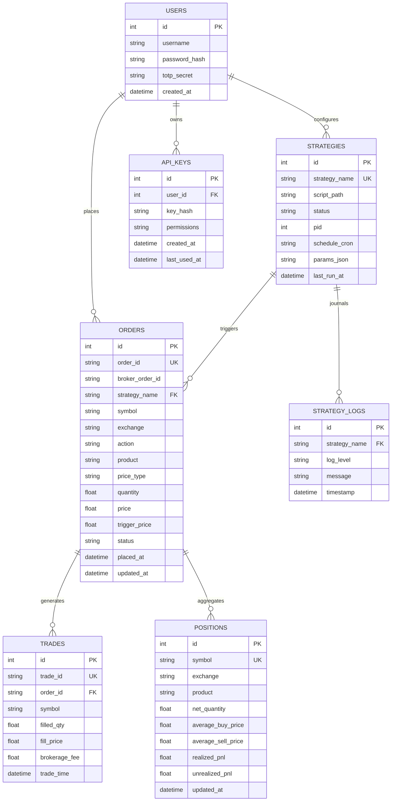

# OpenAlgo Data Model Reference

## Entity-Relationship Diagram



---

## 1. Database Storage Engines

OpenAlgo uses two distinct SQLite databases configured in WAL (Write-Ahead Logging) mode:
1. **Primary Database (`openalgo.db` on Port 5000 / `openalgo_delta.db` on Port 5001)**:
   - Stores users, API authentication credentials, orderbook history, trade logs, strategy configuration registries, and execution audit trails.
2. **Historify Database (`historify.db` / `sandbox_delta.db`)**:
   - Optimized append-only time-series store for raw market ticks, L2 depth snapshots, and synthesized 1m/5m/15m/1H historical OHLCV bars.

---

## 2. Core SQLite Tables & Schemas

### `orders` Table
```sql
CREATE TABLE IF NOT EXISTS orders (
    id INTEGER PRIMARY KEY AUTOINCREMENT,
    order_id TEXT UNIQUE NOT NULL,
    broker_order_id TEXT,
    strategy_name TEXT,
    symbol TEXT NOT NULL,
    exchange TEXT NOT NULL,
    action TEXT NOT NULL CHECK(action IN ('BUY', 'SELL')),
    product TEXT NOT NULL,
    price_type TEXT NOT NULL CHECK(price_type IN ('MARKET', 'LIMIT', 'SL', 'SL-M')),
    quantity REAL NOT NULL,
    price REAL DEFAULT 0.0,
    trigger_price REAL DEFAULT 0.0,
    status TEXT NOT NULL CHECK(status IN ('PENDING', 'OPEN', 'COMPLETE', 'CANCELLED', 'REJECTED')),
    rejection_reason TEXT,
    placed_at DATETIME DEFAULT CURRENT_TIMESTAMP,
    updated_at DATETIME DEFAULT CURRENT_TIMESTAMP
);

CREATE INDEX IF NOT EXISTS idx_orders_symbol ON orders(symbol);
CREATE INDEX IF NOT EXISTS idx_orders_status ON orders(status);
CREATE INDEX IF NOT EXISTS idx_orders_strategy ON orders(strategy_name);
```

### `strategy_configs.json` (Registration Schema)
```json
{
  "strategy_name": "BTC_Liquidity_Sweep_Perp",
  "script_name": "BTC_Liquidity_Sweep_Perp.py",
  "enabled": true,
  "execution_mode": "live",
  "schedule": "0 * * * *",
  "max_capital_risk": 500.0,
  "parameters": {
    "symbol": "BTCUSD",
    "timeframe": "1h",
    "macro_filter": "4h_50_200_ema",
    "swing_lookback_bars": 24,
    "min_rejection_wick": 0.30,
    "risk_reward_target": 2.5,
    "risk_dollars_per_trade": 100.0
  }
}
```

---

## 3. Persistent Strategy State Journal Schema (`.json`)

To prevent orphaned option legs or unrecovered perpetual positions after server crashes, strategies write atomic state checkpoints:

```json
{
  "date": "2026-09-20",
  "strategy": "BTC_Daily_Iron_Condor",
  "state": "ACTIVE",
  "basket_invariant_checked": true,
  "legs": {
    "short_call": {
      "symbol": "C-BTC-110000-200926",
      "strike": 110000,
      "type": "CE",
      "qty": 1,
      "order_id": "ORD_SC_1001",
      "fill_price": 450.5,
      "sl_price": 901.0,
      "status": "FILLED"
    },
    "long_call_wing": {
      "symbol": "C-BTC-114000-200926",
      "strike": 114000,
      "type": "CE",
      "qty": 1,
      "order_id": "ORD_LC_1002",
      "fill_price": 85.0,
      "status": "FILLED"
    }
  },
  "net_credit_collected": 365.5,
  "current_pnl": 120.0,
  "last_updated": "2026-09-20T18:30:00Z"
}
```
