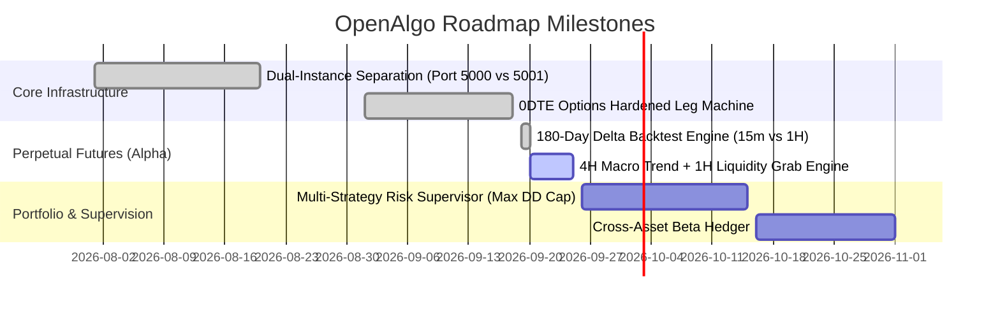

# OpenAlgo Engineering Roadmap

## Milestone Status Overview

---

## 1. Completed Milestones (Production Active)
- [x] **Dual-Instance Routing Architecture**: Fully decoupled Indian domestic markets (`openalgo-angel` on Port 5000) from Delta Exchange crypto (`openalgo-global` on Port 5001).
- [x] **0DTE Crypto Iron Condor Hardened Engine**:
  - Concurrent wing execution via thread pools (20s legging risk eliminated to < 2s).
  - Strike-based symbol resolution with fallback validation.
  - Fail-closed rollback mechanism ensuring orphaned short legs never occur without alerts.
  - Exact-fill PnL accounting from average execution price.
- [x] **180-Day Multi-Timeframe Perpetual Backtesting**:
  - Proved high-frequency 15m SFP loses money due to 1.2% round-trip taker fee churn.
  - Validated 4H Macro Trend + 1H Liquidity Grab model delivering +$10k on BTC and +$10k on ETH.

---

## 2. In-Progress Priorities
- [ ] **Deploy 4H Trend + 1H Liquidity Grab Perpetual Futures Strategy**:
  - Update `BTC_Liquidity_Sweep_Perp.py` with 4H 50/200 EMA macro filter, 24-bar lookback, 30% rejection wick, and 1:2.5 RR.
  - Update `ETH_Liquidity_Sweep_Perp.py` with 4H 50/200 EMA filter, 24-bar lookback, 25% rejection wick, and 1:3.0 RR.
  - Deploy strategy daemons in `openalgo-global` container.
- [ ] **Unified Documentation & Long-Term Memory Enforcement**:
  - Ensure all agents load `/docs/PROJECT.md` and `/docs/ARCHITECTURE.md` on session initialization.

---

## 3. Planned Features
- [ ] **Portfolio-Level Circuit Breakers**:
  - Implement master supervisor (`algo-portfolio`) to monitor combined domestic and crypto drawdowns.
  - Auto-kill all strategy processes if total daily drawdown exceeds 3.0%.
- [ ] **WebSocket Depth L2 Order Flow Engine**:
  - Integrate live orderbook imbalance detection into perpetual entry confirmations.
